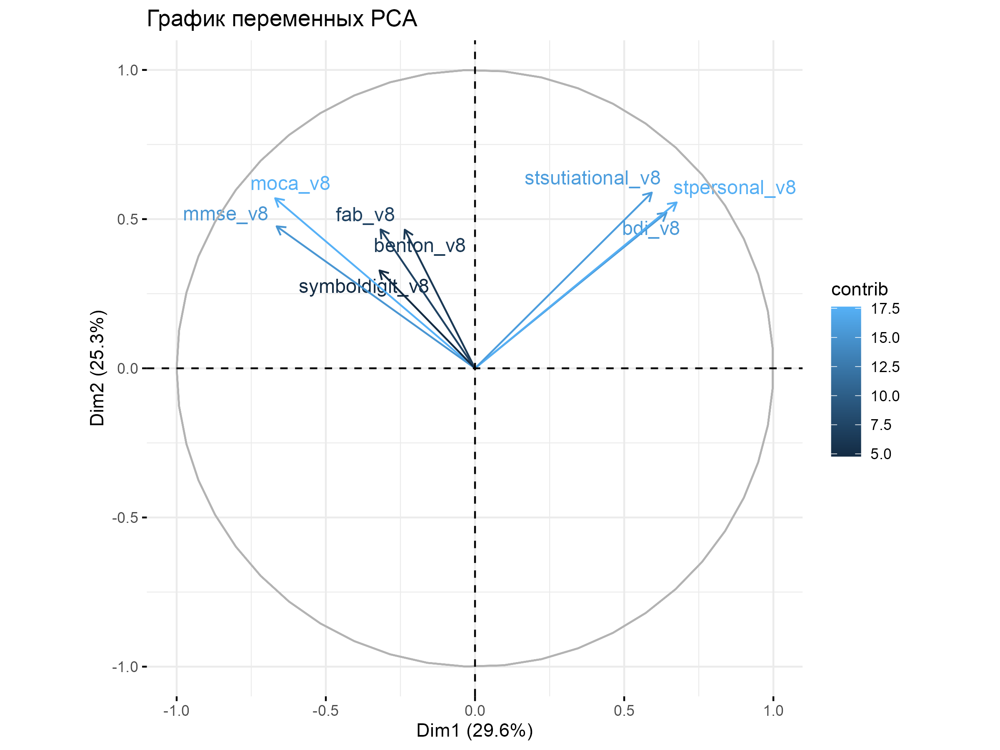
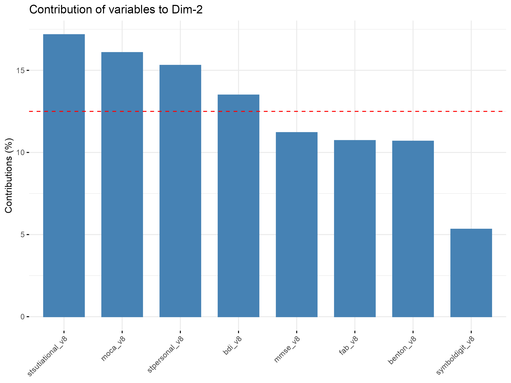

# Cognitive impairment in middle-aged men: a 40-year prospective study

Authors: Meder Imanaliev, Katerina Lind, Aleksandr Rakin, Ksenia Vekhova, Ivan Zarva.

Supervisors: Olga Mironenko, Ksenia Vekhova. 

## Background

Vascular dementia is considered to be the second most common subtype of dementia, after Alzheimer disease, accounting for up to 20% of dementia cases in North America and Europe [1]. In the vast majority of elderly individuals with cardiovascular diseases who develop vascular cognitive impairment (VCI), the brain shows manifestations of vascular damage or dysfunction that contribute to cognitive decline. The underlying mechanisms are not fully understood. However, the most studied one is chronic age-related dysregulation of cerebral blood flow (CBF) which includes impaired permeability of blood–brain barrier (BBB), endothelial dysfunction, and, thus, chronic hypoxia [2]. Most studies that evaluated cognitive outcomes in patients with pronounced cardiovascular damage, as is arterial hypertension, atrial fibrillation, and stroke, were focused on cohorts of older adults (aged ≥ 60 years)  [3-5]. Hence, studying a middle-aged cohort may shed light on association of milder forms of cognitive impairment and cardiovascular events at early stage or in a relatively healthy cardiovascular system. Moreover, milder forms of cognitive decline (subjective and mild cognitive impairment) may correlate with early signs of blood vessel damage, i.e. endothelial dysfunction.

## Aims and objectives

The main goal of this project is to analyze the association of cognitive impairment (CI) with variables describing cardiovascular system, emotional and affective sphere, and neuroimaging data in middle-aged Muscovite men.

The following objectives were set in order to achieve the goal:
1.	To assess the consistency of scales used in cognitive testing
2.	To identify possible predictors of CI
3.	To assess the association between CI and depression / anxiety, variables describing cardiovascular system, and other clinical data in dynamics

## Study design

The initial study design was prospective cohort observational single-center study. It started in 1984 when 23 Moscow schools were randomly selected, and 1143 boys were enrolled (average age 11.9, SD 0.11).
Over 40 years of prospective study, participants underwent 8 medical examinations with different time intervals – before graduation from school there was an annual follow-up (Visits 1-4), later this interval was increased to 4 years (Visit 5), and starting from Visit 6 the interval was 8 years. During the current visit (Visit 8) the average age of participants was 50.9 years (SD 0.70).
The main goal of initial prospective cohort study was to analyze risk factors for cardiovascular diseases from school age.

We decided to focus on cognitive performance that was assessed only during the current visit (Visit 8). Thus, the design of our final project was changed to case-control and cross-sectional.
In order to study association of cognitive performance and variables from previous visits (Visit 1-7) we chose case-control design.
There were also some variables describing MRI data and depression / anxiety inventories that were also performed on the current visit, thus, their association suggested cross-sectional design.

During the current visit (Visit 8) participants underwent complex medical examination that included photoplethysmography using the Angioscan-01 computer appliance (Angioscan, Russia), 
ultrasound imaging of the main arteries (including determination of flow-mediated vasodilation (FMD)) using a Philips iE33 XMATRIX ultrasound system (Netherlands), 
applanation tonometry using SphygmoCor (AtCor Medical, West Ryde, NSW, Australia), Complete blood count and biochemical tests, office blood pressure (BP) measurement, magnetic resonance imaging (MRI), 
and neuropsychological testing.

The diagnostic algorithm for CI consisted of self-reported cognitive decline (complaints about memory loss and its duration in years) and complex neuropsychological testing (12-word Philadelphia Verbal Learning Test (PVLT), Verbal Association Technique (literal and categorical), Münsterberg Test, Benton Visual Retention Test, Clock Test, and Cube Drawing Test, Trail-Making Test A and B, Symbol Digit Modalities Test (SDMT), Montreal Cognitive Assessment (MoCA), Mini–Mental State Examination (MMSE), and Frontal Assessment Battery (FAB)). If a participant reported no complaints and his cognitive tests' scores were ≥26 points for MoCA and/or ≥29 points for MMSE, his cognitive performance was considered normal (**'No CI'** group). If a participant reported memory loss but his cognitive performance was normal, he was diagnosed with **subjective CI**. If cognitive tests' scores were <26 points for MoCA and/or <29 points for MMSE, a participant was diagnosed with **mild CI**. 

Participants also completed Beck Depression Inventory (BDI-II) and Spielberger-Hanin scale of reactive and personal anxiety (SRPA) in order to study their emotional and affective sphere.

## Methods

Statistical analysis was performed using R version 4.3.1 with RStudio 2023.06.1 Build 524. 
After data preprocessing, exploratory data analysis (EDA), and descriptive statistics we created directed acyclic graph (DAG) to represent possible CI predictors. 
Due to the variety of used cognitive tests' scales we assessed their consistency using PCA and McNemar's test. 
In order to compare scores for depression and anxiety in 'no CI' and 'CI' groups as well as overall cognitive performance with MRI data we performed ANOVA, Spearman correlation, and ordinal logistic regression. 
To impute data on possible CI predictors we used the MICE method for missing value imputation.
The association between CI and other variables in dynamics was assessed with mixed-effects models.

## Results

### Descriptive statistics

### PCA and McNemar's test

The consistency of cognitive tests’ scales was assessed using PCA and McNemar's test.

**Figure X. PCA Variable Correlation**

**Figure X. Contribution of Variables to the First Principal Component (Dim-1)**

**Figure X. Contribution of Variables to the Second Principal Component (Dim-2)**

Principal Component Analysis (PCA) was conducted to identify the key contributors to the variance in cognitive function indicators. The first principal component (PC1) explained 29.6% of the total variance, while the second principal component (PC2) accounted for 25.3% (Fig. X). Together, these components captured more than 50% of the total variance in the dataset.

The variable contribution plot for PC1 (Fig. X) revealed that stpersonal_v8, moca_v8, and mmse_v8 (SRPA for personal anxiety, MoCA, and MMSE respectively) were the primary contributors to this dimension, indicating their strong influence on the overall variance structure. In contrast, symboldigit_v8, fab_v8, and benton_v8 (SDMT, FAB, and Benton Visual Retention Test respectively) had notably lower contributions, suggesting they played a lesser role in defining PC1.

Similarly, in PC2 (Fig. X), the highest contributing variables were stsutiational_v8, moca_v8, and stpersonal_v8, reinforcing the importance of executive and memory-related cognitive functions in shaping this component. On the other hand, symboldigit_v8 exhibited the lowest contribution to PC2, implying a relatively minor role in explaining variance in this dimension.

These findings suggest that memory and executive function variables predominantly drive the variance observed in cognitive performance across participants, while other cognitive tests contribute less significantly to the principal components.

### ANOVA, Kruskal-Wallis test, Fisher’s exact test

| **Neuropsychological testing** | **No CI** | **Subjective CI** | **Mild CI** | **p-value** | **SMD** |
| :---:        |     :---:      |    :---:      |    :---:      |    :---:      | :---: |
|    |  n=122 (63.9%)    |   n=38 (19.9%)  | n=31 (16.2%) | |
| 12-word Philadelphia Verbal Learning Test (PVLT) | | | | |
| PVLT Short Delay Free Recall (words)	| 10.02 (1.49) | 9.54 (1.71) |8.83 (1.51) | 0.001 | 0.507 |
| PVLT Short Delay Cued Recall (words)	|  1.82 (1.37) | 2.30 (1.65) |  3.07 (1.46) | <0.001 | 0.564 |
| PVLT Short Delay Summary (words)	| 11.84 (0.45) | 11.84 (0.37) | 11.90 (0.31) | 0.783 | 0.115 |
| PVLT Long Delay Free Recall (words)	|9.56 (1.96) | 9.54 (1.73) |  8.23 (1.77) | 0.003 | 0.488 |
| PVLT Long Delay Cued Recall (words)	 | 2.20 (1.73) | 2.30 (1.70) | 3.63 (1.79) | <0.001 | 0.547 |
| PVLT Long Delay Summary (words)	| 11.75 (0.65) | 11.84 (0.55) | 11.87 (0.35) | 0.552 | 0.140 |
| Verbal Association Technique (literal) (words)	| 13.90 (4.43) | 13.16 (4.59) | 10.87 (5.14) | 0.006 | 0.422 |
| Verbal Association Technique (categorical) (words)	| 20.02 (5.31) | 19.51 (5.40) | 16.59 (3.95) | 0.006 | 0.483 |
| Münsterberg Test (words)	| 16.98 (4.43) | 19.39 (4.03) | 16.96 (5.83) | 0.022 | 0.352 |
| Benton Visual Retention Test (poins)	| 13.12 (1.42) | 13.40 (1.33) | 11.96 (1.68) | <0.001 | 0.633 |
| Clock Test (points)	|  9.61 (0.89) | 9.65 (0.54) | 8.97 (1.55) | 0.004 | 0.383 |
| Cube Drawing Test (points)	|  2.85 (0.38) | 2.92 (0.28) | 2.59 (0.68) | 0.004 | 0.441 |
| Trail-Making Test A (TMT A) (time) | 38.39 (13.94) | 38.00 (13.13) | 37.60 (8.87) | 0.952 | 0.044 |
| Trail-Making Test A (TMT A) (errors) | 0.11 (0.41) | 0.19 (0.52) | 0.30 (0.70) | 0.165 | 0.220 |
| Trail-Making Test B (TMT B) (time) | 105.61 (41.50) | 98.92 (25.54) | 121.70 (54.79) | 0.072 |  0.353 |
| Trail-Making Test B (TMT B) (errors) | 0.51 (1.00) | 0.54 (0.77) |  1.03 (1.35) | 0.044 | 0.306 |
| Symbol Digit Modalities Test (SDMT) (points)	| 45.44 (8.58) | 47.50 (7.51) | 44.60 (7.37) | 0.304 | 0.250 |
| Montreal Cognitive Assessment (MoCA) (points)	| 28.28 (1.28) | 28.12 (1.45) | 24.75 (0.45) | <0.001 | 2.311 |
| Mini–Mental State Examination (MMSE) (points)	| 28.92 (0.98) | 28.91 (1.13) | 26.66 (1.59) | <0.001 | 1.121 |
| Frontal Assessment Battery (FAB) (points)	| 17.42 (0.90) | 17.24 (1.13) | 16.25 (1.58) | <0.001 | 0.606 |
| Spielberger-Hanin scale of reactive anxiety (SRPA) (points)	| 35.60 (7.77) | 37.51 (7.92) | 38.89 (9.04) | 0.111 | 0.265 |
| Spielberger-Hanin scale of personal anxiety (SRPA) (points)	| 38.31 (7.34) | 39.56 (9.03) | 43.92 (8.60) | 0.005 | 0.449 |
| Beck Depression Inventory (BDI) (points)	|  6.64 (4.68) | 8.67 (5.30) |  9.62 (7.85) | 0.015 | 0.337 |

**Table 1. Comparison of scores for neuropsychological tests in CI groups**

| **MRI data** | **No CI** | **Subjective CI** | **Mild CI** | **p-value** | **SMD** |
| :---:        |     :---:      |    :---:      |    :---:      |    :---:      |  :---:      |
|    |  n=122 (63.9%)    |   n=38 (19.9%)  | n=31 (16.2%) | |
| Several vascular lesions 	  |  51 (46.8%)  |   13 (34.2%) |  11 (37.9%) | 0.344 | 0.172 |
| Multiple vascular lesions 	|    20 (18.3%)  |   6 (15.8%) |  5 (17.2%) | 0.937 | 0.045 |
| Perivascular spaces (PV spaces) enlargement	 |   15 (13.8%) |  5 (13.2%) | 9 (31.0%) | 0.069 |0.294 |
| Cerebrovascular fluid (CVF spaces) enlargement	|    22 (20.2%) | 10 (26.3%) | 6 (20.7%) | 0.725 | 0.097|
| Lacunes  |	3 (2.8%) | 0 (0.0%) | 0 (0.0%) | 0.391 | 0.159 |
| Subcortical white matter infarcts	 |  0 (0.0%) | 0 (0.0%) | 2 (6.9%) | 0.006 | 0.257 |
| Hippocampal lesions	 | 3 (2.8%) | 0 (0.0%) | 1 (3.4%) | 0.555 | 0.182|

**Table 2. Associations between MRI data and CI groups**

| **Endothelium function and arterial stiffness** | **No CI** | **Subjective CI** | **Mild CI** | **p-value** | **SMD** |
| :---:        |     :---:      |    :---:      |    :---:      |    :---:      |  :---:      |
|    |  n=122 (63.9%)    |   n=38 (19.9%)  | n=31 (16.2%) | |
| Celermajer test (%)	|  7.35 (3.69) | 6.92 (3.30) | 7.58 (2.97) | 0.736 | 0.133 |
| Pharmacological test index (amplitude)	| 1.89 (0.70) | 1.85 (0.40) |  1.98 (1.21) | 0.798 | 0.098 |
| Pharmacological test index (phase)	| -7.20 (5.08) | -7.73 (6.30) | -5.94 (6.10) | 0.414 | 0.201 |
| Heart rate, beats/min	| 70.21 (10.68) | 68.50 (12.51) | 71.07 (12.96) | 0.647 | 0.140 |
| Augmentation index adjusted to 75 bpm (%)	|  4.40 (11.75) |  2.58 (10.39) |  6.85 (13.88) | 0.371 | 0.235 |
| Vascular age (years)	| 50.20 (10.71) | 48.15 (7.94) | 51.18 (10.20) | 0.463 | 0.214 |
| Oxygen saturation (%)	| 94.49 (2.25) | 95.03 (1.59) | 93.88 (1.87) | 0.104 | 0.411 |
| Augmentation index (peripheral) (%)	| 7.25 (15.95) |  5.96 (12.99) |  8.04 (13.75) | 0.856 | 0.0999 |
| Stiffness index (m/s)	 | 7.91 (0.85) |  7.93 (0.68) |  8.07 (0.82) | 0.617 | 0.142 |
| Ejection duration (%)	| 34.95 (4.27) | 34.68 (4.11) | 34.75 (4.82) | 0.938 | 0.042 |
| Alternative vascular stiffness index (m/s)	|  8.03 (1.70) |  7.75 (1.74) |  8.60 (2.88) | 0.214 | 0.255 |
| Reflection index (%)	| 33.13 (13.11) | 29.89 (8.92) | 31.93 (10.19) | 0.380 | 0.201 |
| Ejection duration (ms)	| 301.41 (20.04) | 306.68 (27.22) | 297.32 (30.20) | 0.282 | 0.235 |
| Pulse wave duration (ms)	| 874.13 (128.94) | 900.94 (151.42) | 871.68 (155.28) | 0.581 | 0.133 |
| Time to 1st peak (peripheral) (ms)	| 112.66 (9.64) | 109.65 (20.39) | 110.21 (15.89) | 0.417 | 0.135 |
| Time to 2nd peak (peripheral) (ms)	| 226.57 (19.81) | 231.65 (25.43) | 223.50 (27.86) | 0.335 | 0.218 |
| dTpp (ms)	| 113.68 (19.55) | 119.06 (22.58) | 111.86 (26.12) | 0.340 | 0.210 |
| Central systolic pressure (predicted) (mmHg)	| 131.74 (17.64) | 129.09 (21.14) | 128.21 (11.92) | 0.538 | 0.140|
| Time of maximum rate of capillary blood filling (ms)	| 39.34 (6.34) | 39.29 (4.88) | 38.46 (3.23) | 0.761 | 0.128 |
| Pulse wave amplitude	|  01 (0.89) | 3.12 (0.76) |  3.31 (0.66) | 0.238 | 0.254 |

**Table 3. Associations between clinical data and CI groups**

To compare scores for neuropsychological assessment in CI groups and the associations between cognitive function and MRI and clinical data, we performed ANOVA analysis. Groups were compared using the Kruskal-Wallis test for continuous variables and Fisher’s exact test for categorical variables.

### Missing value imputation method (MICE)

Only the target variables (**MMSE, MoCA, FAB, SDMT, SRPA, and BDI**) and dependent variables (anthropometric measurements, blood pressure, biochemical markers, and other predictors) were retained from the entire dataset for further analysis. The data were preprocessed by removing records with missing values in key cognitive variables. The dataset was filtered to include only observations where at least one of the target variables and predictors had valid data. 

The missing data structure was analyzed using the md.pattern() function, which visualizes missing value patterns. Before imputation, **14.09% of the data were missing** (1666 values in total). An imputation matrix was constructed to determine which variables were used to restore missing values. In this matrix, target variables were not imputed but used as predictors, while the identifier (id) was completely excluded from the process. Only predictor variables (anthropometric, biochemical, and physiological indicators) were included in the imputation, with 10 iterations and 10 imputed datasets. 

The **Predictive Mean Matching (PMM) method**, implemented in the mice package in R, was used to fill in the missing values. To reduce multicollinearity, height measurements from visits 5 to 8 were averaged into a single variable. This adjustment was necessary because growth curves plateau after the age of 30, making individual height measurements highly correlated. By computing the mean height across these visits, we minimized redundancy in the dataset while preserving essential variability in height-related factors. This approach ensured a more stable statistical model and improved the interpretability of regression analyses.

**Figure X. Missing patterns before imputation**

**Figure X. Missing patterns after imputation**

### Mixed-effects models

The association between CI and variables from previous visits in dynamics was assessed using mixed-effects models. We used clinical data regarding cardiovascular system (systolic and diastolic blood pressure (SBP and DBP respectively) and pulse), atherogenic coefficient ((total cholesterol-high-density lipoprotein cholesterol (HDLc))/HDLc), and body mass index (BMI) (weight (kg)/height^2 (meters)).

**Figure X. LMM results for systolic blood pressure data**

**Figure X. LMM results for pulse data**

**Figure X. LMM results for diastolic blood pressure data**

**Figure X. LMM results for Body Mass Index data**

**Figure X. LMM results for atherogenic coefficient data**

The LMM analysis revealed that none of the included cardiovascular parameters demonstrated a significant association with cognitive or psychological outcomes. Specifically:

1) Systolic Blood Pressure (Fig.X): No statistically significant relationship was found between SBP across visits and cognitive outcomes, as indicated by non-significant F-values (all p>0.05).

2) Diastolic Blood Pressure (Fig.X): Similar to SBP, DBP did not show any meaningful association with CI or psychological measures over time (all p>0.05).

3) Pulse (Fig.X): The analysis did not detect any significant effect of pulse rate on cognitive function or psychological outcomes (all p>0.05).

4) Atherogenic Coefficient (Fig.X): No significant associations were observed between the atherogenic coefficient and cognitive impairment, suggesting no detectable impact of lipid profile dynamics on cognitive status (all p>0.05).

5) Body Mass Index (Fig.X): Changes in BMI over time were not significantly linked to cognitive or psychological outcomes (all p>0.05).

These findings suggest that fluctuations in cardiovascular parameters and metabolic factors over time do not significantly contribute to cognitive impairment in this cohort. The results indicate that other factors may play a more prominent role in the progression of cognitive decline, warranting further investigation.

## Conclusions

Out of 203 participants who attended Visit 8, 191 respondents underwent complex neuropsychological testing along with clinical examination. 122 participants had normal cognitive performance – ‘no CI’ group (63.9%), 38 men were diagnosed with subjective CI (19.9%), and 31 participants had mild CI (16.2%). The results of PCA demonstrated a high contribution of BDI and SRPA to the main components (Dim-1 and Dim-2). Statistically significant difference (p<0.05) in cognitive performance between groups with no CI, subjective CI, and mild CI was found for the following cognitive tests: 12-word Philadelphia Verbal Learning Test (PVLT) for both Short Delay and Long Delay Recall, Verbal Association Technique, Münsterberg Test, Benton Visual Retention Test, Clock Test, Cube Drawing Test, Trail Making Test B, MoCA, MMSE, FAB, SRPA for personal anxiety, and BDI. Association between CI and MRI data was present in two participants (6.9%) with mild CI who had subcortical white matter infarcts (p<0.05). In the endothelium function and arterial stiffness panel, there was no statistically significant difference between groups. None of the predictors (systolic and diastolic BP, pulse, body mass index, and atherogenic coefficient) investigated in linear mixed-effects models showed statistically significant associations with cognitive outcomes based on the D1 test results.

The high contribution of BDI and SRPA inventories to cognitive performance, along with statistically significant differences in BDI scores and personal anxiety questionnaire (SRPA) between groups, may be attributed to the reciprocal influence of emotional and affective factors on cognitive functions. The cognitive tests showing significant differences between groups include not only screening assessments (MoCA and MMSE) but also specialized tests that evaluate memory, associative thinking, visual perception, executive functions, and spatial perception, which cannot be fully assessed using screening scales alone. Since cognitive decline in middle-aged men is not as pronounced, more precise neuropsychological tests are necessary for a detailed assessment. Association between mild CI and morphologic changes on MRI was present in two of 31 men in this group (6.9%). Thus, neurovisualization cannot be used as the main method for detecting subjective and mild CI; however, MRI findings may provide evidence for organic changes in the brain, especially those of vascular etiology. We suggest that diagnostic algorithm for non-dementia stages of CI should include both complex neuropsychological testing as well as neurovisualization.

## Limitations
* Single-center study
* No exact information on CI onset and its dynamics
* Irregular intervals between visits (up to 8 years after participants had graduated from school)
* Cohort specificity (same sex and age)
* Low CI prevalence for this age group
* Loss to follow-up -> no updates on patients’ status, medical history, and reasons for dropout (esp. death)
* Missing values

These limitations forced us to change study design from initial cohort study to case-control study with elements of cross-sectional analysis.

## References:
1.	Rizzi L, Rosset I, Roriz-Cruz M. Global epidemiology of dementia: Alzheimer’s and vascular types. Biomed Res Int. 2014;2014:908915. doi: 10.1155/2014/908915
2.	Zlokovic BV, Gottesman RF, Bernstein KE, et al. Vascular contributions to cognitive impairment and dementia (VCID): A report from the 2018 National Heart, Lung, and Blood Institute and National Institute of Neurological Disorders and Stroke Workshop. Alzheimers Dement. 2020;16(12):1714-1733. doi:10.1002/alz.12157
3.	Qiu C, Winblad B, Fratiglioni L. The age-dependent relation of blood pressure to cognitive function and dementia. Lancet Neurol. 2005;4(8):487-499. doi:10.1016/S1474-4422(05)70141-1
4.	Ding M, Fratiglioni L, Johnell K, et al. Atrial fibrillation, antithrombotic treatment, and cognitive aging: A population-based study. Neurology. 2018;91(19):e1732-e1740. doi:10.1212/WNL.0000000000006456
5.	Srithumsuk W, Kabayama M, Gondo Y, et al. The importance of stroke as a risk factor of cognitive decline in community dwelling older and oldest peoples: the SONIC study. BMC Geriatr. 2020;20(1):24. Published 2020 Jan 22. doi:10.1186/s12877-020-1423-5
